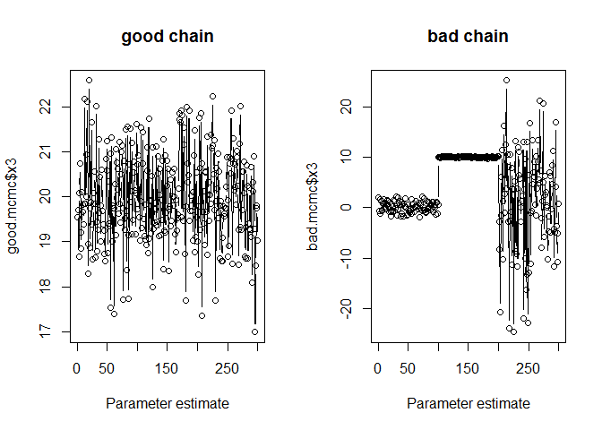

#### *Listening to MCMC outputs, the acoustic MCMC package:*

This package contains functions for listening to MCMC outputs. The idea is that a good output should result in relatively static sounds, i.e., well behaved parameter estimates coming from the MCMC chains should be result a steady sound. Whereas in a badly performing MCMC should provide a more dynamic listening experience.

The aim is to collect a variety of ways of listening to the outputs of MCMC chains, and is mostly just for fun...

#### *Small example:*

``` r
#install the package
library(devtools)
```

    ## Warning: package 'devtools' was built under R version 3.4.3

``` r
install_github("tbonne/acousticMCMC")
```

    ## Downloading GitHub repo tbonne/acousticMCMC@master
    ## from URL https://api.github.com/repos/tbonne/acousticMCMC/zipball/master

    ## Installing acousticMCMC

    ## "C:/PROGRA~1/R/R-34~1.1/bin/x64/R" --no-site-file --no-environ --no-save  \
    ##   --no-restore --quiet CMD INSTALL  \
    ##   "C:/Users/t-work/AppData/Local/Temp/RtmpmOmcCI/devtoolsbdc6e343928/tbonne-acousticMCMC-0c2d821"  \
    ##   --library="C:/Users/t-work/R/win-library/3.4" --install-tests

    ## 

``` r
library(acousticMCMC)

#create of use your own outputs: example MCMC outputs from a 3 parameter model
good.mcmc <- data.frame(x1 = rnorm(300,0,1),
                         x2 = rnorm(300,10,1),
                         x3 = rnorm(300,20,1) )
bad.mcmc <- data.frame(x1 = rnorm(300,0,1),
                        x2 = rnorm(300,10,1), 
                        x3 = c(rnorm(100,0,1),rnorm(100,10,0.1),rnorm(100,0,10)) )

#take a look at the chains
par(mfrow=c(1,2))
plot(good.mcmc$x3,type="b", main="good chain", xlab="Parameter estimate") 
plot(bad.mcmc$x3,type="b", main="bad chain", xlab="Parameter estimate") 
```



``` r
#lisen to MCMC chain
noisyMCMC(good.mcmc)
```

    ## Warning: running command 'C:\Windows\system32\cmd.exe /c ""c:/Program
    ## Files/Windows Media Player/wmplayer.exe" "C:\Users\t-work\AppData\Local
    ## \Temp\RtmpmOmcCI/tuneRtemp.wav""' had status 5

    ## Warning in shell(paste("\"", paste(player, ..., shQuote(object)), "\"", :
    ## '""c:/Program Files/Windows Media Player/wmplayer.exe" "C:\Users\t-work
    ## \AppData\Local\Temp\RtmpmOmcCI/tuneRtemp.wav""' execution failed with error
    ## code 5

``` r
noisyMCMC(bad.mcmc)
```

    ## Warning: running command 'C:\Windows\system32\cmd.exe /c ""c:/Program
    ## Files/Windows Media Player/wmplayer.exe" "C:\Users\t-work\AppData\Local
    ## \Temp\RtmpmOmcCI/tuneRtemp.wav""' had status 5

    ## Warning: '""c:/Program Files/Windows Media Player/wmplayer.exe" "C:\Users
    ## \t-work\AppData\Local\Temp\RtmpmOmcCI/tuneRtemp.wav""' execution failed
    ## with error code 5

#### *Going forward:*

There might be a million ways to listen to this kind of output. What might be most challenging in the contexts of MCMC outputs is the dimensionality (i.e., many parameters), the alternate scaling of parameters, and turning that into some kind of acoustic output. With the ultimate goal of better distinguishing the quality of the MCMC estimation.
